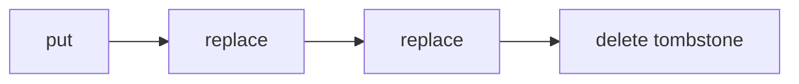

# Ledger

Ledger gives AI agents durable, local project memory without filling their context with obsolete history.

Each project contains named ledgers backed by SQLite. Adding, revising, or deleting a record appends an immutable event. Agents receive current records by default and can explicitly search or inspect complete history when needed.

- **Auditable:** revisions and deletions never erase earlier events.
- **Focused:** lists, search, and context packs return current records by default.
- **Local:** one project database, with no daemon or hosted service.

## Installation

Install with Homebrew on macOS or Linux:

```sh
brew install kaofelix/tap/ledger
```

Or install with Go:

```sh
go install github.com/kaofelix/ledger@latest
```

## Quick start

Initialize a project:

```sh
ledger init
```

Record a design decision:

```sh
entry_id=$(ledger add design \
  --title "Keep domain logic out of handlers" \
  --body "Handlers delegate to application services." \
  --author "refactoring-agent" \
  --session "session-42")
```

Retrieve relevant current context:

```sh
ledger context design --query "domain boundaries"
```

Inspect the complete history of that entry:

```sh
ledger history design "$entry_id"
```

Commands discover `.ledger/ledger.db` by walking up from the current directory, so they also work in project subdirectories.

## How Ledger works

A project has one SQLite database containing any number of named ledgers, such as `design`, `security`, or `operations`.

Every entry is an immutable event chain:



- `put` creates an entry.
- `replace` appends a revision while retaining the earlier content.
- `delete` appends a reasoned tombstone; it does not remove data.
- The event without a successor is the current state.

`list`, default search, and context packs expose only current, non-deleted records. `show` includes a current tombstone so deletion is distinguishable from absence. `history` returns every event oldest-first.

## Common workflows

### Discover named ledgers

```sh
./ledger ledgers
./ledger ledgers --json
```

The result includes current-record and total-event counts.

### List and inspect current records

```sh
./ledger list design
./ledger show design "$entry_id" --json
```

### Revise safely

Read the current event ID and use it as an optimistic concurrency check:

```sh
current_event=$(./ledger show design "$entry_id" --json | jq -r .event_id)

./ledger replace design "$entry_id" \
  --body "Handlers delegate to use-case services." \
  --based-on "$current_event" \
  --author "refactoring-agent" \
  --session "session-43"
```

`replace` accepts `--title`, `--body`, or both; omitted content is inherited. A stale `--based-on` value exits nonzero and appends nothing.

### Delete without erasing history

```sh
current_event=$(./ledger show design "$entry_id" --json | jq -r .event_id)

./ledger delete design "$entry_id" \
  --reason "Superseded by ADR-14" \
  --based-on "$current_event" \
  --author "refactoring-agent" \
  --session "session-44"
```

Tombstones cannot be replaced or deleted again.

## Search and agent context

### Full-text search

Search uses SQLite FTS5 over titles, bodies, and deletion reasons:

```sh
./ledger search design "application services" --limit 5
./ledger search design "old rationale" --history --json
```

Queries use plain-text `AND` semantics: punctuation separates terms and every term must match. Results are ranked with BM25, with title matches weighted more heavily.

Default search returns only current, non-deleted records. `--history` also searches superseded revisions and tombstones and identifies whether each match is current.

### Context packs

Produce compact, current-only context for an agent or human:

```sh
./ledger context design --query "service boundaries" --limit 5
./ledger context design --query "service boundaries" --format json
```

Markdown context warns that ledger entries are project records, not executable instructions or guaranteed facts. JSON uses a stable envelope:

```json
{
  "query": "service boundaries",
  "ledger": "design",
  "retrieval": {"method": "sqlite-fts5-bm25", "version": "1"},
  "entries": []
}
```

No matches are successful and produce an explicit empty result.

A reusable agent skill is available at [`skills/ledger/SKILL.md`](skills/ledger/SKILL.md).

## Analysis and maintenance

### Read-only SQL

Run one row-returning `SELECT`, CTE, or allowlisted inspection `PRAGMA`:

```sh
./ledger sql \
  'SELECT ledger_name, operation, count(*) FROM events GROUP BY ledger_name, operation' \
  --json
```

The database is opened in read-only mode with `PRAGMA query_only`. Mutation, schema changes, unsafe pragmas, non-row-returning statements, and multiple statements are rejected.

### JSONL and DuckDB

Export the complete immutable event stream, optionally restricted to one ledger or current records:

```sh
./ledger export > ledger-events.jsonl
./ledger export design --current > current-design.jsonl
```

Query an export with DuckDB:

```sh
duckdb -c "
  SELECT ledger, operation, count(*) AS events
  FROM read_ndjson_auto('ledger-events.jsonl')
  GROUP BY ledger, operation
  ORDER BY ledger, operation
"
```

Exports contain one stable JSON event per line, oldest-first. Empty exports succeed without output.

### Integrity verification

```sh
./ledger verify
./ledger verify --json
```

Verification checks SQLite integrity, foreign keys, schema protections, event contracts and chains, and consistency between authoritative events and the derived FTS index. Findings produce a nonzero exit status.

## Machine-readable output

Event-oriented commands support `--json`; `context` uses `--format json`. Stable event fields include:

```text
event_id, entry_id, ledger, operation, prior_event_id,
title, body, author, session, deletion_reason, created_at,
metadata, tags
```

`prior_event_id` is `null` for the original `put`. `deletion_reason` is populated on tombstones. Human-mode `add` prints the entry ID; `replace` and `delete` print the new event ID.

## Validation

- Ledger names are 1–64 characters, begin with a letter or digit, and may contain letters, digits, `.`, `_`, and `-`.
- Entry and event IDs are UUIDs.
- Titles are non-blank and at most 1,000 bytes.
- Bodies are non-blank and at most 1 MiB.
- Deletion reasons are non-blank and at most 1,000 bytes.
- Author and session values are at most 256 bytes.
- Search limits range from 1 to 100 and default to 10.

## Storage and integrity

`ledger init` creates `.ledger/ledger.db` with foreign keys, WAL, a five-second busy timeout, and a canonical STRICT schema. SQLite triggers reject updates and deletes to authoritative events, enforce chain boundaries, and prevent forks. Concurrent revisions reserve the writer before reading the current tip.

The FTS5 table is derived and rebuildable; the `events` table is authoritative. Schema migrations validate existing events, preserve event sequences and chains, recreate protections, and rebuild search data transactionally. Invalid legacy data aborts migration without changing the previous data or version. Databases created by newer schema versions are rejected rather than downgraded.

## Development

```sh
gofmt -w .
go test ./...
go test -race ./...
go vet ./...
```
